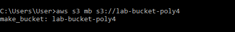
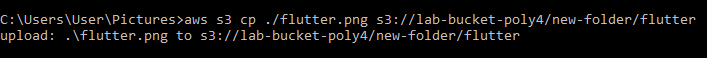
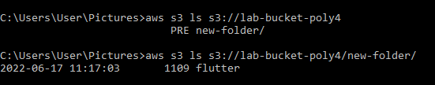
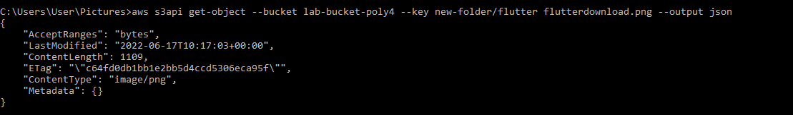
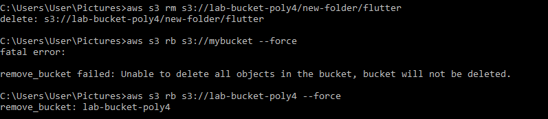

This Week lab will focus on getting you acquainted with Amazon S3 using the aws cli

# Task 1: Create a S3 bucket using AWS CLI

1. Lauch AWS cloud shell
2. Create a S3 bucket 
3. Create a folder in your S3 bucket
4. Upload objects to your S3 bucket
5. List the object in your S3 bucket
6. Download Object from your S3 bucket
7. Delete object in your s3 bucket
8. Delete your S3 bucket


## Solution
1. I am using my local AWS CLI 

2. I created a S3 bucket using the below command

    ```
        aws s3 mb s3://lab-bucket-poly4
    ```

    > Here is output of command :
    

3.
4. I upload a file into the `s3://lab-bucket-poly4/new-folder/flutter` using the below command, this also create a new folder called `new-folder` automatically

    ```
        aws s3 cp ./flutter.png s3://lab-bucket-poly4/new-folder/flutter
    ```

    > Here is output of command :
    

5. I list the objects in my s3 buckets using the below command:

    ```
        aws s3 ls s3://lab-bucket-poly4
        aws s3 ls s3://lab-bucket-poly4/new-folder/
    ```

    > Here is output of command :
    

6. I download object from my bucket using the below command

    ```
        aws s3api get-object --bucket lab-bucket-poly4 --key new-folder/flutter flutterdownload.png --output json
    ```

    > Here is output of command :
    

7. I delete object from my bucket using the below command

    ```
        aws s3 rm s3://lab-bucket-poly4/new-folder/flutter 
    ```

8. I delete my s3 bucket using the below command

    ```
        aws s3 rb s3://lab-bucket-poly4 --force 
    ```

    > Here is output of both deletion :
    


For guide, kindly visit

https://docs.aws.amazon.com/cli/latest/reference/s3api/create-bucket.html

https://docs.aws.amazon.com/AmazonS3/latest/userguide/Welcome.html

https://docs.aws.amazon.com/cli/latest/userguide/cli-services-s3-commands.html
