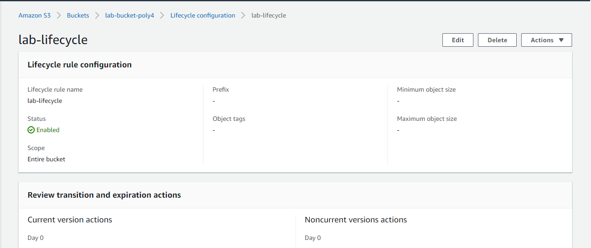

# Task 2: Create Amazon S3 bucket with bucket policies and life cycle management

1. Launch AWS Console
2. Create a S3 bucket with enforced ownership
3. Create a single lifecycle policy
4. Create a single bucket policy
5. Delete all policies
6. Delete S3 bucket

## Solution
1. I launch my AWS console

2. I created a new s3 bucket on the S3 console and enforced the bucket ownership

    > Here is preview of the console :
    

3. I add a lifecycle policy to the bucket under the `management` tab in the console. The policy move non-current version to archive after 50 days

    > Here is preview of the console :
    

4. I add a bucket policy to the bucket under the `Permissions` tab in the console. The policy allows anonymous users to read the buckets

    > Here is preview of the console :
    

5. I deleted the policy from the bucket console

6. I deleted the bucket from the S3 bucket console 

    > Here is preview of the console :
    

For guide, kindly visit

https://docs.aws.amazon.com/cli/latest/reference/s3api/create-bucket.html

https://docs.aws.amazon.com/AmazonS3/latest/userguide/Welcome.html

https://docs.aws.amazon.com/cli/latest/userguide/cli-services-s3-commands.html
