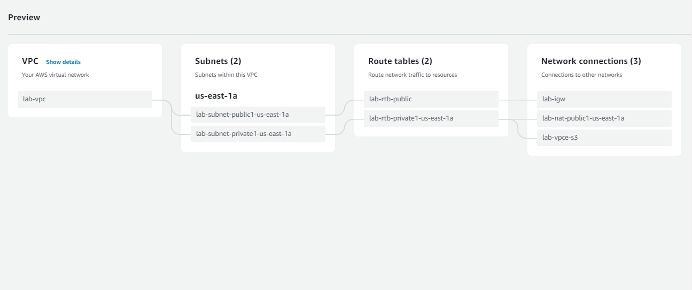
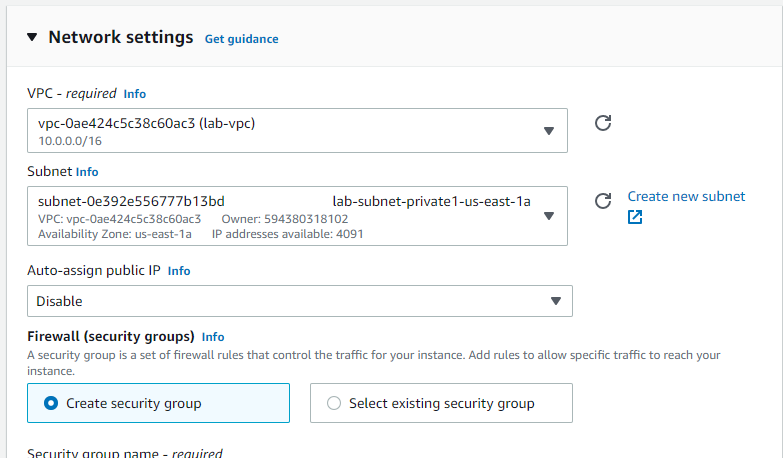
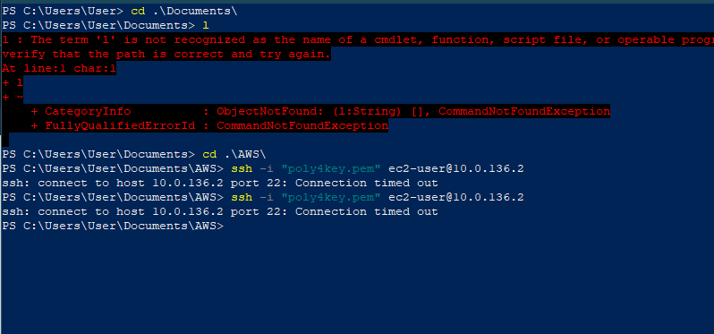

This task will get you acquainted on how to deploy VPC 

Task 1: Deploy VPC using Management console
1. Launch the AWS Management Console
2. Launch a VPC with one public and one private subnets.
3. Create two route table and associate  each one to each subnets
4. Attach an internet gateway to the VPC and a NAT gateway to the private subnet.
5. Lauch a Linux instance into this VPC and attach the subnet
6. Test the network connectivity
7. Perform clean up actions

For guide, you are check the links below:

https://docs.aws.amazon.com/cli/latest/reference/ec2/

https://docs.aws.amazon.com/cli/latest/reference/ec2/describe-vpcs.html

## Solution
1. I launch my AWS console

2. I created a new VPC using the *VPC and more* option on the VPC creation wizard

   > Here is preview of the console :
     

3. I created an amazon Linux instance  into the VPC I created above by specifying the network settings
   
   > Here is preview of the console :
    

4. I tried ssh to the instance from a different computer and it was unsuccesful, because it's in a private subnet

    > Here is preview of the terminal :
    