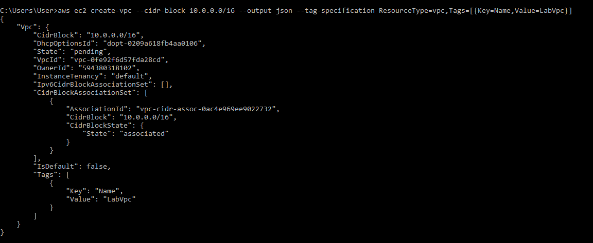
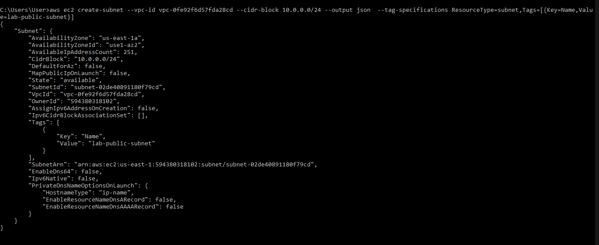
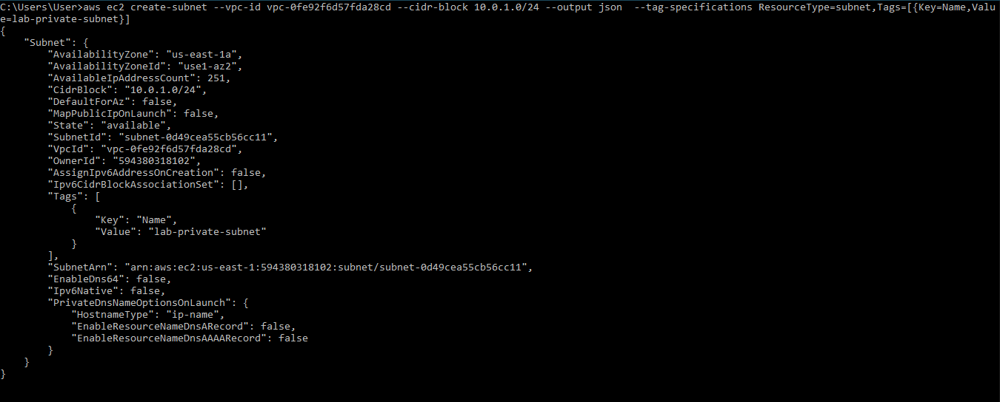
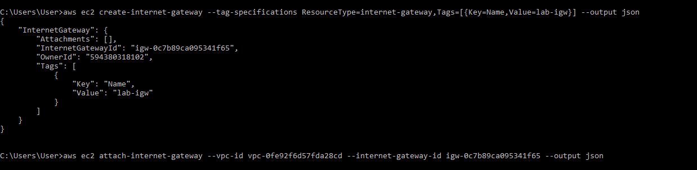
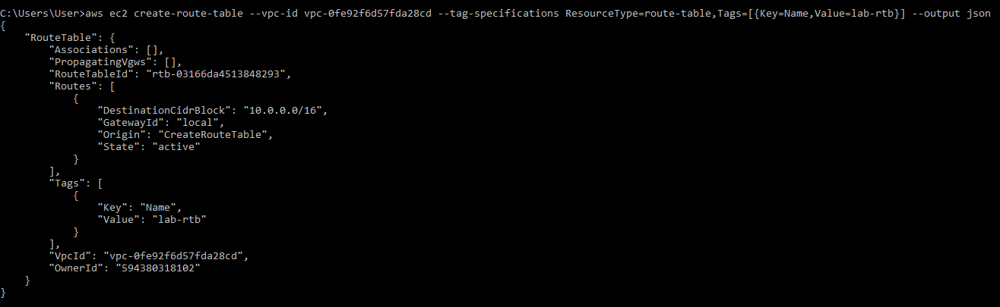
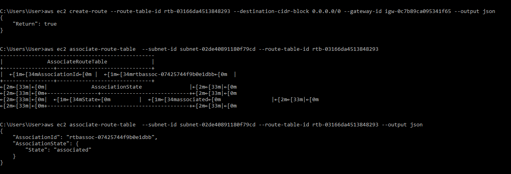
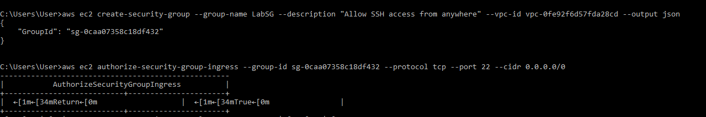
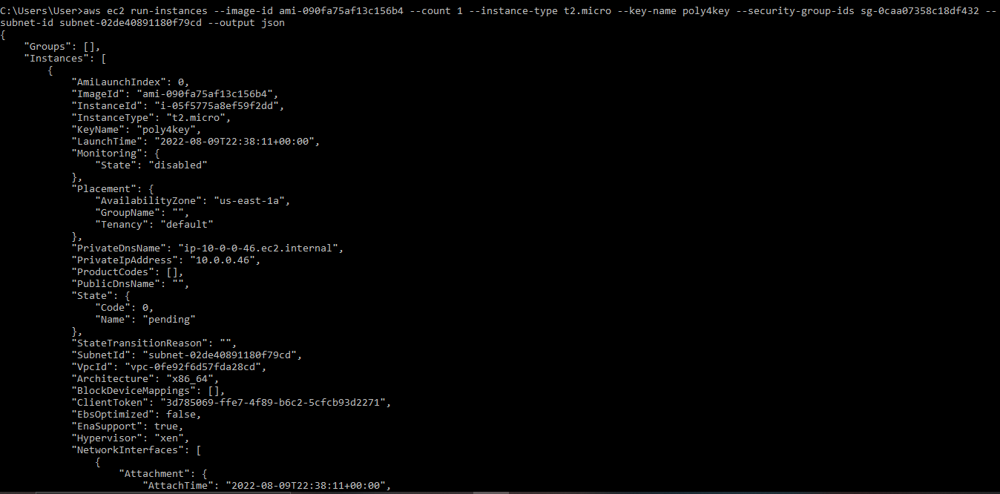
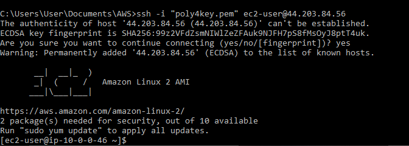

Task: Create a nondefault VPC using AWS CLI

1. Open your CLI and run a configuration setting
2. Lauch a VPC 
3. Create two subnets (a public and a private subnet)
4. Make your subnet public by creating and attaching an internet gateway
5. Create a security group and add a SSH access from anywhere
6. Lauch an instance into your subnet 
7. Clean Up


## Solution
1. I opened my CLI and make sure I am authenticated
2. I launched a VPC using the cli *create-vpc* command

    > Here is terminal :
     

3. I created 2 subnets using the `create-subnet` command, one that will be public and another that will remain private
   
   > Here is terminal :
     
     

4. To make the subnet public, I created an internet gateway and attach it to the vpc
   
   > Here is terminal :
     

5. I created a route table in the vpc using the `create-route-table` command
   
   > Here is terminal :
     

6. I then created a route that points all traffic to the internet gateway, then attach it to the subnet to make it public
   
   > Here is terminal :
     

7. I created a security group in my VPC using the `create-security-group` command, that allows SSH from anywhere
   
   > Here is terminal :
     

8. I modified the IP addressing of the public subnet to map a public IP address to the instance launched into the subnet using this below command
   
   ```
        aws ec2 modify-subnet-attribute --subnet-id subnet-02de40891180f79cd --map-public-ip-on-launch
    ```

9.  Using an existing key pair, I launched a linux instance into the public subnet of the VPC 
   
   > Here is terminal :
     

11. I tested the connectivity by SSH into the instance just created and it was successful

    > Here is terminal :
     

https://docs.aws.amazon.com/vpc/latest/userguide/vpc-subnets-commands-example.html

https://docs.aws.amazon.com/vpc/latest/userguide/vpc-subnets-commands-example-ipv6.html

https://docs.aws.amazon.com/vpc/index.html